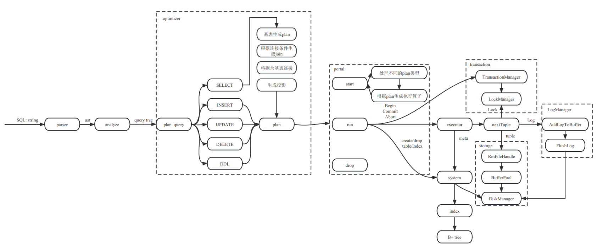

# Fame Dock: An efficient and open-source database engine

## Synopsis

Fame Dock is an efficient and open-source database engine that provides a high-level abstraction of the underlying storage system. It is designed to be easy to use and easy to integrate into existing applications. Fame Dock is written in C++ and is designed to be portable across multiple platforms. Fame Dock is designed to be scalable and can handle large datasets with ease. Fame Dock is designed to be easy to maintain and extend, and it provides a rich set of features that make it a versatile and powerful database engine. The following is a high-level overview of Fame Dock:



Fame Dock consists of two components: the server and the client. The server is responsible for managing the database and processing queries. The client is responsible for sending queries to the server and receiving the results. The server and client communicate using a binary protocol that is designed to be efficient and easy to integrate into existing applications.

You can check the documentation for more details on the legacy rmdb project, click [here](rmdb/README.md).

## Getting Started

To get started with Fame Dock, you can follow the steps below:

1. Install the required dependencies:

- Fame Dock requires the following dependencies to be installed on your system:

  - A C++ compiler (e.g., g++ or clang++)
  - CMake
  - Flex
  - Bison
  - Readline

- On Ubuntu, you can install the required dependencies using the following command:

  ```bash
  sudo apt-get install g++ cmake flex bison libreadline-dev build-essential -y
  ```

- On Windows, you can install the required dependencies using the following steps:

  - Install Visual Studio 2019 or later.
  - Install CMake from the official website.
  - Install Flex and Bison from the official website.
  - Install the Windows version of Readline from the official website.
  - Add the following environment variables to your system:

    ```
    PATH=C:\Program Files (x86)\FlexBison\bin;%PATH%
    PATH=C:\Program Files (x86)\CMake\bin;%PATH%
    PATH=C:\Program Files (x86)\GnuWin32\bin;%PATH%
    ```

  - The PATH environment variable should include the directories where Flex and Bison are installed, as well as the directory where CMake is installed. The abovementioned environment variables is specific to your installation and can be added to the system PATH variable by editing the system environment variables.

- In other systems, you can install the required dependencies using the appropriate package manager.

2. Install Fame Dock on your system. You can download the latest release source code from the [GitHub repository](https://github.com/xforcevesa/fame-dock) and build Fame Dock from source using the provided instructions:

- To build Fame Dock server:

   ```bash
   git clone https://github.com/xforcevesa/fame-dock.git
   cd rmdb
   mkdir build
   cd build
   cmake .. -DCMAKE_BUILD_TYPE=Release
   make -j$(nproc)
   ```

- To build Fame Dock client (before this you should change the working directory to rmdb):

   ```bash
   cd rmdb/rmdb_client
   mkdir build
   cd build
   cmake .. -DCMAKE_BUILD_TYPE=Release
   make -j$(nproc)
   ```

3. Start the Fame Dock server:

- To start the Fame Dock server (before this you should change the working directory to rmdb):

   ```bash
   cd rmdb/build/bin
   ./rmdb_server
   ```

4. Connect to the Fame Dock server using a client:

- To connect to the Fame Dock server using the Fame Dock client (before this you should change the working directory to rmdb):

   ```bash
   cd rmdb/rmdb_client/build/
   ./rmdb_client
   ```

## Motivation

Fame Dock was created to provide a high-level abstraction of the underlying storage system, making it easy to use and easy to integrate into existing applications. Fame Dock is designed to be scalable and can handle large datasets with ease. Fame Dock is designed to be easy to maintain and extend, and it provides a rich set of features that make it a versatile and powerful database engine.

## Features

Fame Dock provides the following features:

- **Schema-less design:** Fame Dock is schema-less, meaning that it does not require the user to specify the schema of the data beforehand. Instead, Fame Dock automatically infers the schema from the data and stores it in a schema-like format. This allows for easy data migration and evolution.

- **Efficient storage:** Fame Dock is designed to be efficient and can handle large datasets with ease. It uses a combination of indexing, compression, and caching techniques to achieve high performance.

- **Rich set of features:** Fame Dock provides a rich set of features that SQL languages also provide, which make it a versatile and powerful database engine. These features include:

  - **Transactions:** Fame Dock supports transactions, which allow multiple operations to be executed atomically.

  - **Query language:** Fame Dock provides a powerful query language that allows users to retrieve data from the database using a variety of criteria.

  - **Joins:** Fame Dock supports joins, which allow users to retrieve data from multiple tables based on their relationships.

  - **Views:** Fame Dock supports views, which allow users to create virtual tables based on the results of a query.

  - **Indexes:** Fame Dock supports indexes, which allow users to quickly locate data based on specific criteria.

  - **Functions:** Fame Dock supports functions, which allow users to perform complex operations on data.

  - **Triggers:** Fame Dock supports triggers, which allow users to execute custom code when certain events occur.

  - **Security:** Fame Dock provides security features, including encryption, access control, and authentication.

- **Open-source:** Fame Dock is open-source, which means that it is freely available for anyone to use, modify, and distribute. Fame Dock is released under the BSD license, which allows for both personal and commercial use.

- **Portable:** Fame Dock is designed to be portable across multiple platforms, including Linux, Windows, and macOS. Fame Dock uses a combination of C++ and platform-specific libraries to achieve this portability.

- **Scalable:** Fame Dock is designed to be scalable and can handle large datasets with ease. It uses a combination of indexing, caching, and compression techniques to achieve high performance. Fame Dock also provides features such as sharding and replication to allow for horizontal scaling.

## Documentation

Fame Dock provides extensive documentation, including a user guide and a reference manual. The user guide provides a step-by-step guide to using Fame Dock, while the reference manual provides a complete reference of all the available features and commands. The documentation is available in both HTML and PDF formats.

## License

Fame Dock is released under the MIT license, which allows for both personal and commercial use.
